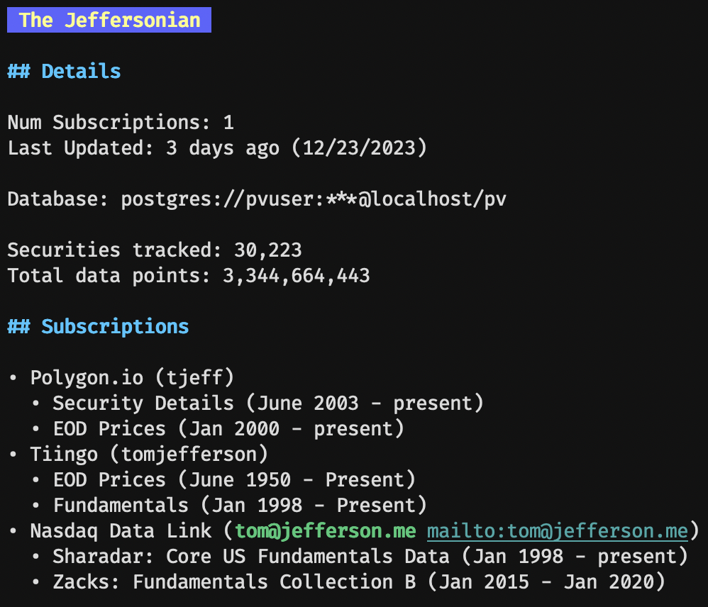

# pv-data

pv-data is a command line utility for building and maintaining a database
of price, fundamental, alternative, and various other types of data useful
in quantitative investing. Databases built by pv-data are used by the
penny-vault investment ecosystem to run backtests and perform live trading.

A key challenge in developing and executing quantitative investment strategies
is curating a reliable data library. There are many sources of investment data
including:

* [Tiingo](https://www.tiingo.com)
* [Nasdaq Data Link](https://data.nasdaq.com)
* [Polygon.io](https://polygon.io)
* custom datasets

Even though the data from each of these sources may be similar they all have
their own individual schema and method of obtaining data. pv-data solves these
challenges by maintaining a list of subscriptions and converting data from its
native schema into a format understood by penny-vault.

## Requirements

* PostgreSQL database

## Getting started

### Initialize Library

The first step is to initialize your data library. This will create a new
database configuration and initialize the system with the default required
tables.

```bash
pvdata init
```

This will start the library initialization wizard.

    * PostgreSQL connection string: postgres://[[user]:[password]]@<server>[:<port>]/dbname
    * Library Name: The Jeffersonian
    * Library Owner: Thomas Jefferson

### View library summary

To inspect the details of your library run:

```bash
pvdata info
```



### Create new subscriptions

To list all supported providers run:

```bash
pvdata providers
```

```bash
pvdata subscribe polygon
```

## Monitoring Imports

Part of maintaining a healthy data library is ensuring that data imports successfully run. From
time to time failures can occur due to your server being offline, errors on the side of the
data provider, etc.

The service `healthchecks.io` provides an excellent service for monitoring jobs that should run
periodically. The service acts as a deadmans switch where the running job must toggle the check
within a specific time interval or an alert will be generated.

`pvdata` integrates with `healthchecks.io` and can automatically create checks for each subscription.
To use the interation create a new project on `healthchecks.io` and create a new API key. Place the
key in the `.pvdata.toml` configuration file.

```toml
[healthchecks]
apikey = '<my api key>'
```

## Adding new data providers

pv-data can dynamically load additional provider libraries.

Each provider must implement the `Subscription` interface.

```go
// Name returns the unique name that identifies this data provider;
// e.g. Nasdaq Data Link
Name() string

// Description returns a short description of the provider that pv-data
// presents to the user when proviers are listed
Description() string

// AuthenticationDetails returns a map of parameters the user must provide
// when creating a new subscription. The returned map defines the keys
// used for each parameter and provides a description of the parameter.
// e.g.: {"apiKey": "api key assigned to your account for accessing data"}
AuthenticationDetails() map[string]string

// Datasets returns a list of Dataset the user may subscribe to
Datasets() []*Dataset

// Subscribe creates a new subscription that persists across runs
// of the pv-data tool
Subscribe(Auth map[string]string, *Dataset, interval string) (*Subscription, error)

type Subscription interface {
    Fetch(since time.Time) ([]Record, error)
    Stream(chan<- Record, <-chan Command, <-chan error)
}
```

The frequency pv-data fetches data is defined by an Interval. Each interval is defined
by a string.

    Daily string = "?"
    Continuous string = "stream"
    BeforeMarketOpen string = "?[0-930]"
    AfterMarketClose string = "?[1600-2399]"
    Every5Min string = "*/5"
